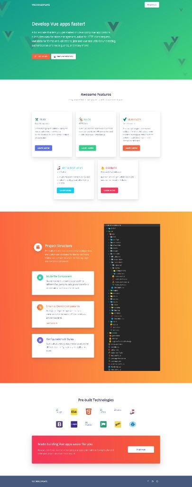

# Vue 2 Boilerplate

[](https://vuejs.org/)
[](https://cli.vuejs.org/)

A starter template for building Vue 2 applications with authentication, state management, HTTP requests, and form validation already wired up. Skip the repetitive setup and focus on building features.

**[Live demo](https://vue-boilerplate.netlify.app/)** · **[GitHub](https://github.com/sprmke/vue2_boilerplate)**



---

## Features

- **Vue Router** — History mode routing with lazy-loaded auth pages
- **Vuex** — Centralized auth state, mutations, and actions
- **Firebase Auth & Realtime Database** — Sign up, sign in, and persist user profiles via REST API
- **Axios** — Global HTTP client with a dedicated auth instance and interceptors
- **Vuelidate** — Model-based form validation on the registration flow
- **Route guards** — Protected dashboard route with `beforeEnter` navigation guard
- **Auto-login** — Restores sessions from `localStorage` with token expiration handling
- **Sass** — Scoped component styles with SCSS support

## Tech stack

| Category | Tools |
| --- | --- |
| Framework | Vue 2, Vue Router, Vuex |
| HTTP | Axios |
| Validation | Vuelidate |
| Backend | Firebase Authentication & Realtime Database |
| Tooling | Vue CLI 3, Babel, ESLint, Prettier, Sass |

## Getting started

### Prerequisites

- [Node.js](https://nodejs.org/) (v10+ recommended for this Vue CLI 3 project)
- npm

### Installation

```bash
git clone https://github.com/sprmke/vue2_boilerplate.git
cd vue2_boilerplate
npm install
```

### Development

```bash
npm run serve
```

The app runs at [http://localhost:8080](http://localhost:8080) with hot reload enabled.

### Production build

```bash
npm run build
```

Output is written to the `dist/` directory.

### Lint

```bash
npm run lint
```

## Firebase configuration

This boilerplate uses Firebase Authentication and the Realtime Database through their REST APIs. Before deploying your own instance, update the following:

1. **Realtime Database URL** in `src/main.js`:

   ```js
   axios.defaults.baseURL = 'https://YOUR-PROJECT.firebaseio.com';
   ```

2. **Firebase Web API key** in `src/store.js` (used by the `register` and `login` actions):

   ```js
   axiosAuth.post('/signupNewUser?key=YOUR_API_KEY', { ... })
   axiosAuth.post('/verifyPassword?key=YOUR_API_KEY', { ... })
   ```

Create a Firebase project, enable Email/Password authentication, and set up Realtime Database rules appropriate for your use case.

## Project structure

```
vue2_boilerplate/
├── public/
│   └── index.html          # HTML shell
├── src/
│   ├── components/
│   │   ├── header/
│   │   │   └── Header.vue  # App navigation (auth-aware)
│   │   └── home/
│   │       └── Welcome.vue # Landing welcome message
│   ├── views/
│   │   ├── Home.vue        # Home page
│   │   ├── Login.vue       # Sign-in form
│   │   ├── Register.vue    # Sign-up form with Vuelidate
│   │   └── Dashboard.vue   # Protected page (requires auth)
│   ├── App.vue             # Root component
│   ├── axios-auth.js       # Axios instance for Firebase Auth API
│   ├── main.js             # App entry, global Axios setup
│   ├── router.js           # Routes and navigation guards
│   └── store.js            # Vuex store (auth state & actions)
├── babel.config.js
├── package.json
└── README.md
```

## Routes

| Path | Name | Access | Description |
| --- | --- | --- | --- |
| `/` | home | Public | Welcome page with links to register or login |
| `/register` | register | Public | Registration form with validation |
| `/login` | login | Public | Sign-in form |
| `/dashboard` | dashboard | Protected | Authenticated user dashboard |

Unauthenticated users who visit `/dashboard` are redirected to `/login`.

## How authentication works

1. **Register / Login** — Credentials are sent to Firebase Auth via `axios-auth.js`. On success, the ID token and user ID are stored in Vuex and `localStorage`.
2. **Auto-login** — On app load, `App.vue` dispatches `autoLogin`, which restores the session if a valid, non-expired token exists.
3. **Logout timer** — After login, a timer is set based on Firebase token expiration to automatically log the user out.
4. **Route guard** — The dashboard route checks `store.state.idToken` before allowing navigation.
5. **User profile** — After reaching the dashboard, user data is fetched from the Realtime Database.

## Scripts

| Command | Description |
| --- | --- |
| `npm run serve` | Start development server |
| `npm run build` | Build for production |
| `npm run lint` | Lint and auto-fix with ESLint |

## Customization

See the [Vue CLI configuration reference](https://cli.vuejs.org/config/) for build and dev-server options. Add a `vue.config.js` at the project root when you need custom webpack, proxy, or output settings.

## Contributing

Issues and pull requests are welcome. For major changes, please open an issue first to discuss what you would like to change.
